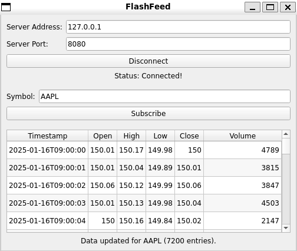

# FlashFeed v0.1

## 📌 Overview

The **FlashFeed** is a C++ application designed for fetching, processing, serving, and visualizing financial market data in real-time. T

### FlashFeed GUI Client v0.1

*Real-time market data visualization*


### Key Components

- **Market Data Server**: Fetches real-time intraday stock data from Alpha Vantage API (currently supported) with CSV fallback support
- **GUI Client**: Qt5-based graphical interface with table-based data visualization
- **Data Processing Pipeline**: Efficient parsing and caching of market data with support for multiple formats

## ✨ Key Features

- **Real-time Data Fetching**: Connects to Alpha Vantage API for live intraday market data
- **Robust Fallback System**: Automatically falls back to CSV files when API is unavailable
- **High-Performance Networking**: TCP/IP streaming using Boost.Asio with multi-client support
- **JSON-Based Protocol**: Efficient client-server communication protocol
- **Multi-threaded Architecture**: Responsive UI and concurrent client handling
- **Configurable Design**: JSON-based configuration system
- **Extensible Parser Framework**: Factory pattern supporting multiple data formats
- **Professional Logging**: Comprehensive logging system with configurable levels

## 🏗️ Architecture

```
┌─────────────────┐    ┌──────────────────┐    ┌─────────────────┐
│                 │    │                  │    │                 │
│  Alpha Vantage  │◄───┤  Market Data     │───►│   TCP Clients   │
│     API         │    │     Server       │    │      (GUI)      │
│                 │    │                  │    │                 │
└─────────────────┘    └──────────────────┘    └─────────────────┘
                              │
                              ▼
                       ┌──────────────┐
                       │   CSV Files  │
                       │  (Fallback)  │
                       └──────────────┘
```

## 📂 Project Structure

```
Market_Parser/
├── CMakeLists.txt               # Main CMake build configuration
├── README.md                    # This file
├── include/                     # Header files
│   ├── BenchMark.hpp           # Performance timing utilities
│   ├── Configuration.hpp        # Configuration management
│   ├── DataParser.hpp          # Data parsing interfaces
│   ├── Logger.hpp              # Logging system
│   ├── MarketDataClient.hpp    # Client functionality
│   ├── MarketDataServer.hpp    # Server functionality
│   └── gui/                    # GUI-specific headers
│       └── MainWindow.hpp
├── src/                        # Source code
│   ├── BenchMark.cpp
│   ├── Configuration.cpp
│   ├── DataParser.cpp
│   ├── Logger.cpp
│   ├── MarketDataServer.cpp
│   ├── MainServer.cpp          # Server entry point
│   └── gui/                    # GUI implementation
│       ├── MainGui.cpp         # GUI entry point
│       └── MainWindow.cpp
├── input/                      # Configuration files
│   └── config.json            # Main configuration
├── data/                       # Sample market data (CSV fallback)
│   ├── market_data_AAPL.csv
│   ├── market_data_MSFT.csv
│   └── market_data_GOOGL.csv
├── test/                       # Test applications
│   ├── TestMarketDataServer.cpp
│   └── TestMarketDataClient.cpp
└── build/                      # Build output (generated)
```

## 🛠️ Dependencies

This project requires:

### Core Dependencies
- **C++17 Compiler** (GCC 7+, Clang 6+, MSVC 2017+)
- **CMake** 3.16 or higher

### Third-Party Libraries
- **Boost** 1.74+
  - System, Thread, Filesystem, Date_Time, Program_options
  - Asio (networking), Beast (HTTPS)
- **OpenSSL** (for HTTPS communication)
- **Qt5** 5.15+ (Widgets module for GUI)
- **nlohmann/json** (automatically fetched via CMake)

## 🚀 Building the Project

### 1. Install Dependencies

#### Ubuntu/Debian:
```bash
sudo apt update
sudo apt install build-essential cmake libboost-all-dev libssl-dev qtbase5-dev
```

### 2. Build the Project

```bash
# Clone the repository
git clone <repo-url>
cd FlashFeed

# Create build directory
mkdir build && cd build

# Configure and build
cmake ..
make -j$(nproc)  # Linux/macOS
```

### 3. Generated Executables

After building, you'll find these executables in `build/`:
- `Market_Parser_Server` - Market data server
- `Market_Parser_GUI_Client` - GUI client

## ⚙️ Configuration

### Alpha Vantage API Key Setup

1. Get a free API key from [Alpha Vantage](https://www.alphavantage.co/support/#api-key)
2. Edit `input/config.json`:

```json
{
  "logging": {
    "log_file_path": "market_data_log.txt"
  },
  "server": {
    "port": 8080,
    "api_key": "YOUR_ALPHA_VANTAGE_API_KEY_HERE",
    "api_refresh_seconds": 60,
    "symbols": ["AAPL", "MSFT", "GOOGL"],
    "csv_fallback_paths": {
      "AAPL": "data/market_data_AAPL.csv",
      "MSFT": "data/market_data_MSFT.csv",
      "GOOGL": "data/market_data_GOOGL.csv"
    }
  },
  "client": {
    "server_address": "127.0.0.1"
  }
}
```

## ▶️ Running the Applications

### 1. Start the Market Data Server
```bash
cd build
./Market_Parser_Server
```
The server will:
- Load configuration from `../input/config.json`
- Start fetching data from Alpha Vantage API
- Listen for client connections on port 8080 (configurable)

### 3. Run GUI Client
```bash
# In a new terminal
cd build
./Market_Parser_GUI_Client
```
- Enter server connection details
- Subscribe to symbols via the GUI
- View data in a sortable table format

## 📊 Data Format

### Market Data Entry Structure
```cpp
struct MarketDataEntry {
    std::string timestamp;  // ISO format: "2025-01-16T09:00:00"
    double open;           // Opening price
    double high;           // Highest price
    double low;            // Lowest price  
    double close;          // Closing price
    double volume;         // Trading volume
};
```

### CSV Format (for fallback data)
```csv
timestamp,open,high,low,close,volume
2025-01-16T09:00:00,150.25,151.00,149.50,150.75,1000000
2025-01-16T09:01:00,150.75,151.25,150.25,151.00,875000
```

## 🔍 Logging

Application logs are written to the file specified in `config.json` (default: `market_data_log.txt`).

Log levels include:
- **INFO**: Normal operation events
- **WARNING**: Non-critical issues (e.g., API rate limits)
- **ERROR**: Critical failures requiring attention

## 🧪 Testing

Basic test clients are provided in the `test/` directory:
```bash
cd build
./TestMarketDataServer  # Simulated market data server
./TestMarketDataClient  # Basic connectivity test
```

## 🤝 Contributing

Contributions are welcome! 

### Code Style
- Use modern C++17 features appropriately
- Follow RAII principles
- Prefer STL containers and algorithms
- Use meaningful variable and function names
- Add comments for complex algorithms

## 📝 License

This project is licensed under the MIT License - see the [LICENSE](LICENSE) file for details.

## 🙏 Acknowledgments

- [Alpha Vantage](https://www.alphavantage.co/) for providing free market data API
- [Boost C++ Libraries](https://www.boost.org/) for networking and utilities
- [nlohmann/json](https://github.com/nlohmann/json) for JSON processing
- [Qt](https://www.qt.io/) for cross-platform GUI framework

## 📞 Support

For questions, issues, or feature requests, please:
1. Check existing [Issues](../../issues)
2. Create a new issue with detailed description
3. Include relevant log files and configuration


